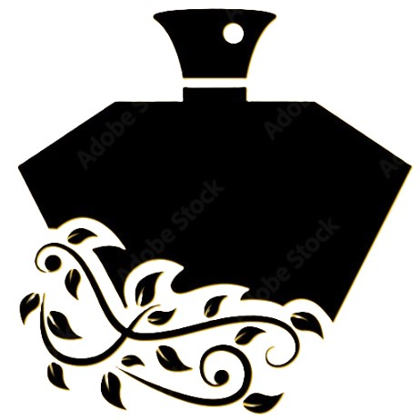

# NLP-WordCloud-LeParfum
Création d'un WordCloud sur la première page du livre Le Parfum de Patrick Süskind
## N'hésitez pas à consulter le notebook IPYNB pour voir le déroulement.

    

# Deux WordCloud : 
Le premier est un wordcloud classique, le deuxième utilise une image en modèle.

    

